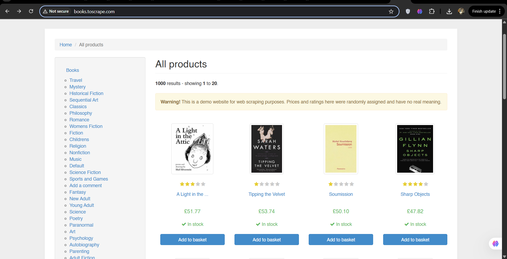
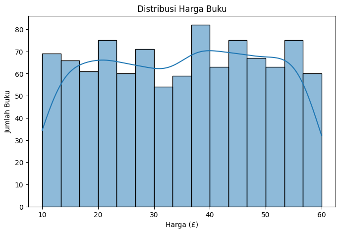
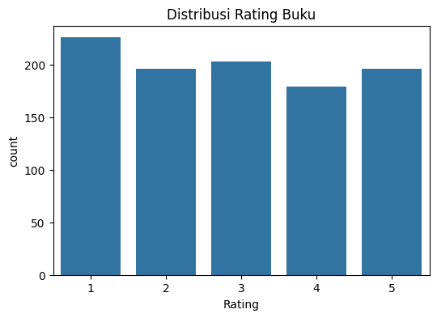
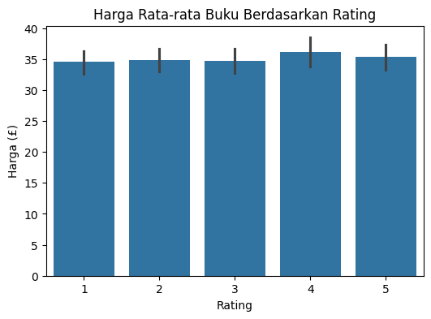
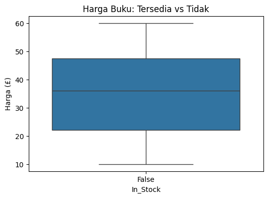
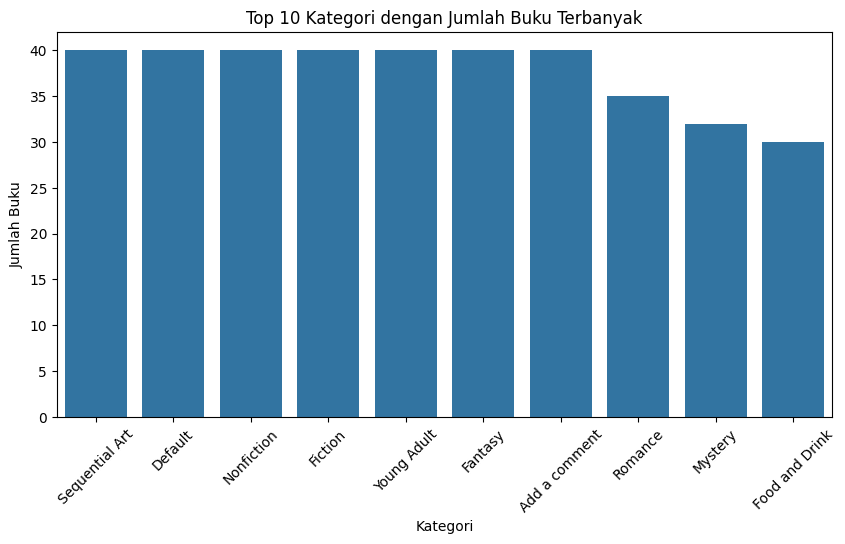
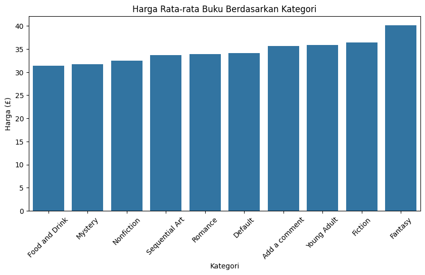

# 📘 Web Scraping & Data Analysis: Books to Scrape

## 📌 Overview

Project ini bertujuan untuk melakukan **web scraping** dari website [Books to Scrape](http://books.toscrape.com) dan melakukan **analisis data** terhadap informasi buku yang tersedia, termasuk:

- Judul buku
- Harga
- Rating
- Ketersediaan stok
- Kategori buku

Data yang dikumpulkan kemudian diolah dan divisualisasikan untuk menghasilkan insight bisnis yang relevan, seperti tren harga, rating, dan kategori buku terpopuler.

---

## 🛠️ Tools & Library

- **Python 3**
- **Jupyter Notebook**
- Library yang digunakan:
  - `requests` – Mengambil konten HTML dari website
  - `BeautifulSoup` – Parsing data HTML
  - `pandas` – Manipulasi data tabular
  - `matplotlib` & `seaborn` – Visualisasi data

---

## 🔄 Workflow

### 1. **Scraping Daftar Kategori Buku**
Mengambil semua kategori buku dari sidebar navigasi website.

### 2. **Scraping Buku per Kategori**
Melakukan scraping untuk maksimal 2 halaman dari setiap kategori, dan mengambil informasi:
- Judul buku
- Harga (tanpa simbol £)
- Rating (dikonversi dari teks ke angka)
- Status ketersediaan
- Nama kategori

### 3. **Preprocessing Data**
- Konversi rating teks ke angka (One → 1, dst.)
- Pembersihan data ketersediaan menjadi boolean `In_Stock`
- Penggabungan semua data ke dalam satu DataFrame

### 4. **Analisis Data dan Visualisasi**
Beberapa analisis yang dilakukan:
#### Distribusi Harga Buku
Visualisasi distribusi harga dari semua buku:

---

#### Distribusi Rating Buku
Jumlah buku berdasarkan rating:

---

#### Harga Rata-rata Berdasarkan Rating
Perbandingan harga rata-rata berdasarkan rating buku:

---

#### Perbandingan Harga Buku yang Tersedia vs Tidak Tersedia
Visualisasi harga buku berdasarkan status ketersediaan:

---

#### Top 10 Kategori dengan Jumlah Buku Terbanyak
Kategori buku paling banyak tersedia:

---

#### Harga Rata-rata Buku per Kategori
Harga rata-rata buku berdasarkan kategori terpopuler:

---

## 📊 Hasil Visualisasi

Berikut insight dari analisis data:

- **Sebagian besar buku** memiliki harga antara £10–£50.
- Buku dengan **rating tinggi** sedikit lebih mahal.
- Buku yang tersedia (`In Stock`) memiliki harga lebih beragam.
- Kategori seperti **"sequential art"** dan **"Nonfiction"** memiliki jumlah buku terbanyak.
- Kategori seperti **"fantasy"** dan **"fiction"** memiliki harga rata-rata buku yang lebih tinggi.
